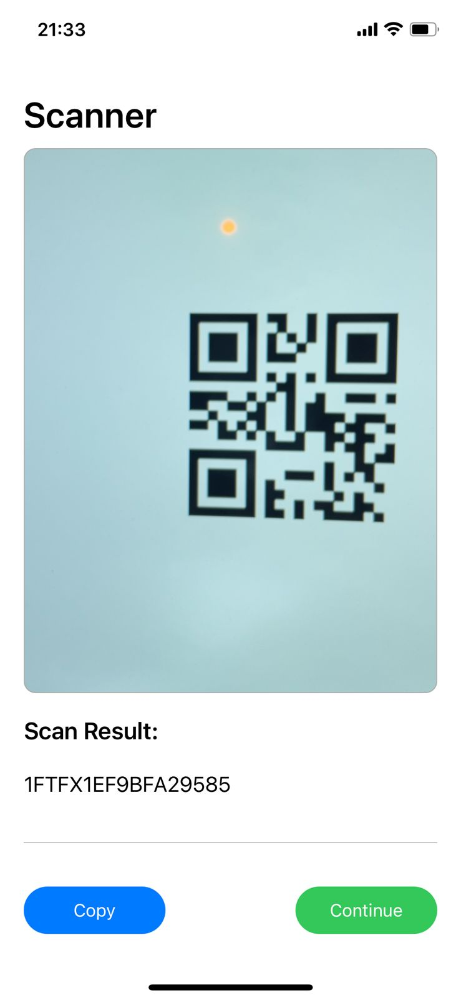
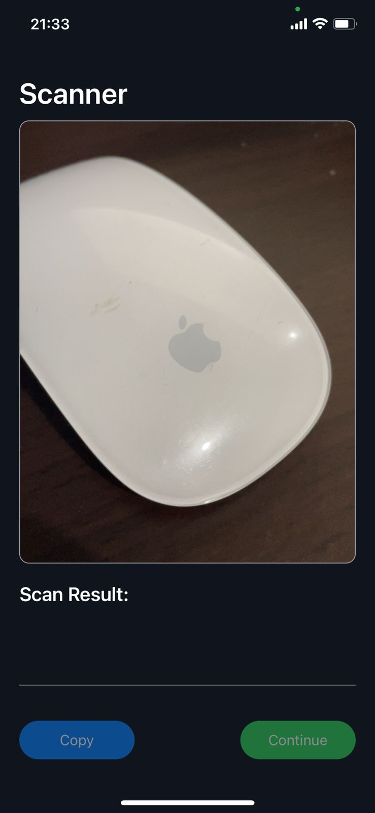
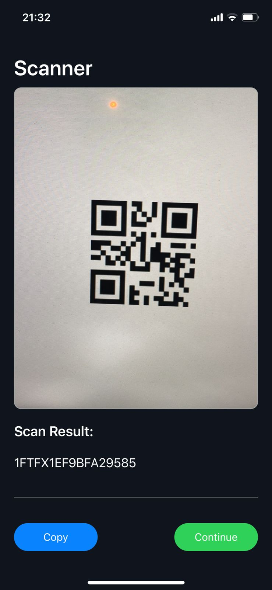
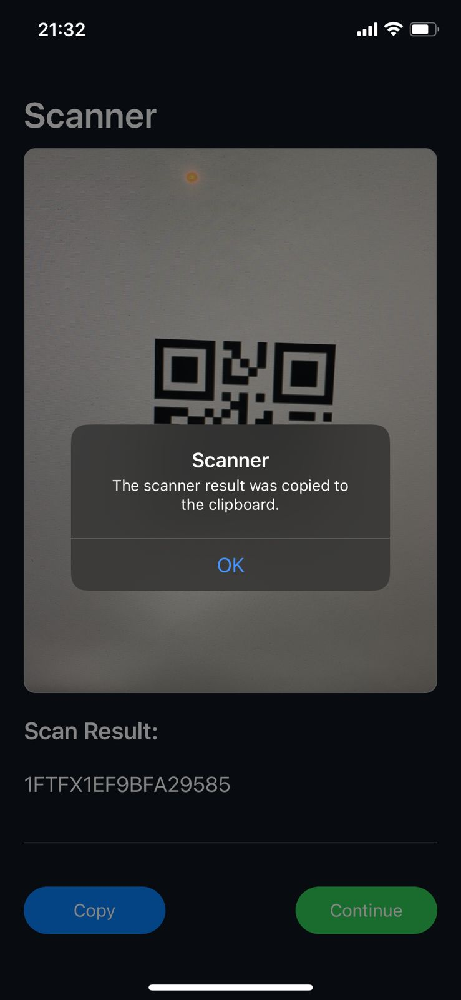

# Scanner - iOS app built with Swift
This is a native iOS app created with Swift and using the framework AVFoundation.
The main functionality of the app is to scan some of the most popular codes:

* QR
* DataMatrix
* Code39
* Code128
* Code93
* Code39Mod43
* Pdf417
* Ean8
* Ean13
* Itf14

Here are some screenshots of the application.

<b>Home screen in light mode</b>

<b>Home screen in dark mode</b>

<b>Scanning a QR code</b>

<b>Copying the result</b>

